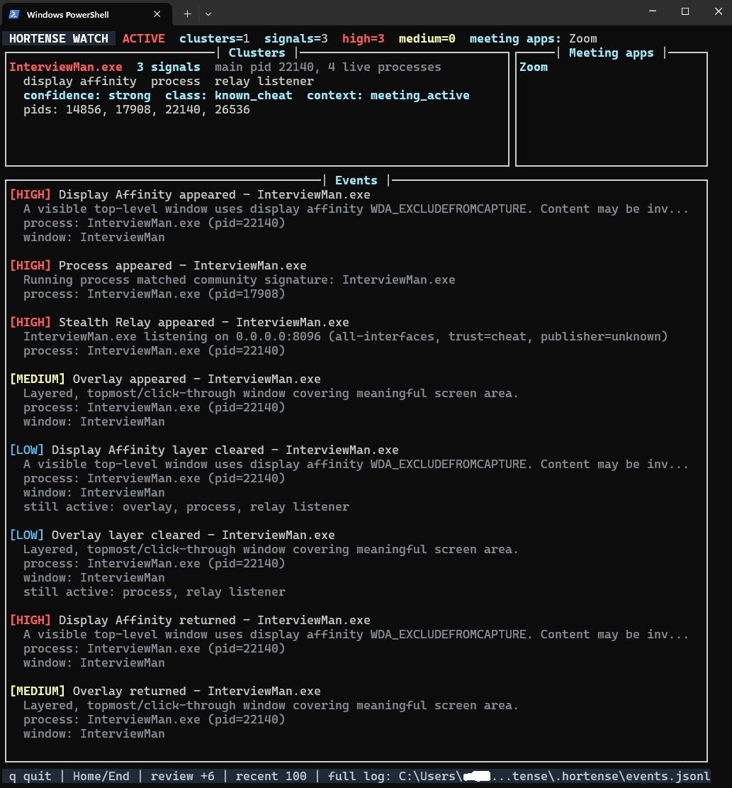
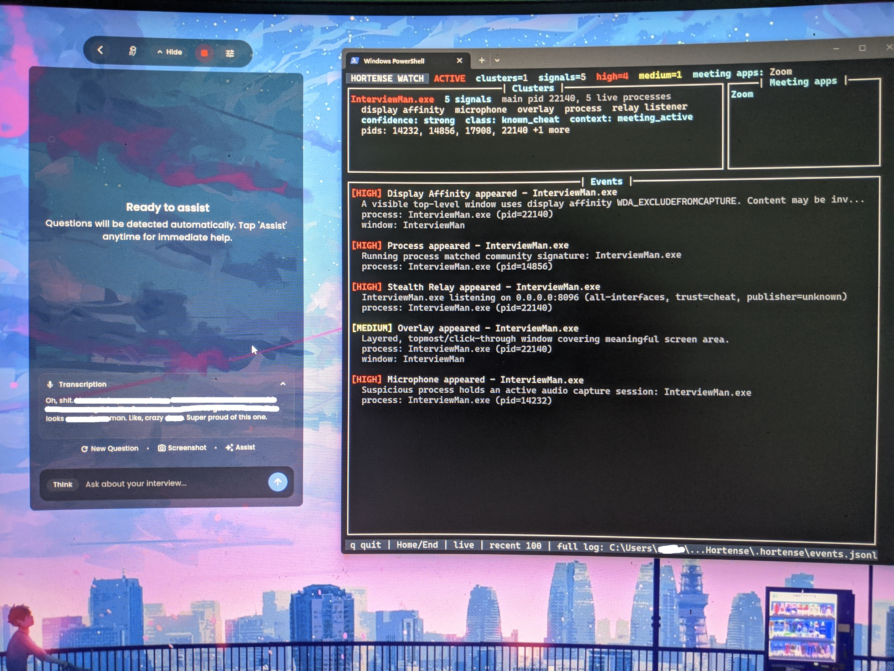

# Hortense

```text
╻ ╻┏━┓┏━┓╺┳╸┏━╸┏┓╻┏━┓┏━╸
┣━┫┃ ┃┣┳┛ ┃ ┣╸ ┃┗┫┗━┓┣╸ 
╹ ╹┗━┛╹┗╸ ╹ ┗━╸╹ ╹┗━┛┗━╸
```

Windows interview-integrity research tool. Detects screen-capture exclusion, suspicious overlays, known process signatures, microphone capture with product-stack context, outbound AI API connections, and PC-to-phone stealth relay listeners.

Hortense looks for the Win32 traces behind interview-assist tools: `WDA_EXCLUDEFROMCAPTURE`, screen-share invisible windows, click-through overlays, microphone capture, helper-owned WebView2 audio, local TCP relay listeners used by InterviewMan and its generic Weather Tracker build, and process trees tied to tools like Cluely, Parakeet, and LinkJobAI.

The point is simple: compare what the call can see with what Windows knows is actually on the machine.

`watch` turns that into a live board. It shows ACTIVE or PRE-CALL state, native meeting apps by name, current product clusters, confidence, and the recent activity trail. Local evidence can appear before a meeting app opens. A relay tied to a modified app or a cheat-shaped cluster stays visible while it is still open, so closing a meeting never fake-clears something that remains on the machine.

Findings group by install root and parent tree, not by one PID. Relay, overlay, microphone, and process evidence from the same product fuse into one cluster. The board shows a main pid, live process count, and capped pid line while the cluster is active; `[CLEARED]` and JSONL keep the full session pid roll-up.

Known meeting apps, AV agents, and signed install paths sit on a hybrid trust catalog so legitimate software stays quiet. Cheat signatures still win first. Known app names still have to prove signer and path; a modified or unofficial build is an integrity anomaly, not automatic cheating. No single signal convicts. The stack does. Full reasoning and limits: [How Hortense deduces](THREAT_MODEL.md#how-hortense-deduces).

**Platform:** Windows only (CLI). Build from source; no prebuilt trust required.

## What Hortense Sees



This is local evidence from `hortense watch`: product cluster, relay listener, confidence, meeting context, live PIDs, and recent lifecycle events in one place. It is not a catalog shot of the cheat UI. Hortense is showing the endpoint story the screen share does not tell.

## Detection coverage

| Signal | Status | What it means |
|--------|--------|---------------|
| Display affinity (`WDA_EXCLUDEFROMCAPTURE`, `WDA_MONITOR`) | Live | Windows hidden from screen capture but visible on the monitor |
| Overlay heuristics | Live | Layered, topmost, click-through windows covering the real screen |
| Process signatures | Live | Name, path, install-tree roots, child processes |
| Microphone correlation | Live | Mic capture is collected when present, attributed through WebView2 or process ancestry, and graded by product-stack context instead of treated as a meeting-only verdict |
| Network correlation | Live | Connections to the AI endpoints in `configs/signatures.yml` |
| Stealth relay (PC-to-phone link) | Live | Local TCP listeners and LAN peers; cheat-first trust, product-cluster fusion, confidence-tiered visibility (modified-app and threat relays stay visible off-call, bare listeners are call-context), bounded lifecycle view in `watch` |
| Trust catalog | Live | Bundled seed merged into local `.hortense/trusted_catalog.yml`; `hortense catalog update` / `catalog status` |
| Known-app integrity anomaly | Live | Cataloged app name with unsigned, invalid, wrong-publisher, or unexpected-path evidence |
| Allowlist suppression | Live | Zoom, Teams, Chrome and system processes excluded by design |
| Capture-path discrepancy | Planned | DXGI duplication against a deeper per-window read |
| Browser/test attestation | Planned | Local companion verifies meeting app, test browser, and capture path agree |
| Relay / API piggybacking | Partial | Direct model endpoints are live; relay piggybacking on trusted hosts is planned work |
| UDP / QUIC network paths | Planned | UDP owner tables, DNS/ETW history, and rolling timing buffers for short-lived sockets |
| Call-presence confidence | Partial | Mic ownership now feeds product confidence without accusing benign mic-only apps; camera ownership, meeting window titles, browser call context, and network/DNS clues remain planned |
| GPU scanout / vendor APIs | Boundary only | No vendor/kernel framebuffer access; future discrepancy checks can catch visible effects |
| Kernel-level evasion | Boundary only | No kernel agent; user-mode checks can still flag capture/window mismatches |
| Second device (phone, laptop, earpiece) | Out of scope | Outside the endpoint boundary; no local scanner has a sensor there |

## Detection results

Field runs on a real Windows machine. The table is a surface map, not a verdict machine.

| Signal | Parakeet | Cluely | LinkJobAI | InterviewMan standard | Weather Tracker (IM generic) | InterviewMan / Weather Tracker stealth |
|--------|----------|--------|-----------|-----------------------|------------------------------|------------------------------------|
| Display affinity | Caught | Caught (undetectable mode on) | Caught | Caught | Caught | Caught at dashboard startup, then cleared when hidden |
| Overlay heuristics | Caught | Not flagged | Caught | Caught | Caught | Caught at dashboard startup, then cleared when hidden |
| Process / path / tree | Caught | Caught | Caught | Caught | Caught | Caught |
| Microphone | Caught | Caught | Caught through WebView2 ancestry | Caught | Caught | Not the main path; phone carries the assist |
| Relay listener | Not observed | Not observed | Not observed | Caught | Caught | Caught and retained |
| Network | Not observed | Not observed | Not observed | Local relay shape | Local relay shape | Local relay shape |

### Parakeet

**Verdict:** Caught as `pmodule.exe`: display affinity, overlay behavior, process signature, and microphone capture.


### Cluely

**Verdict:** Caught in undetectable mode: display affinity, process signature, and microphone capture. With undetectable mode off, the window behaved more like a normal app, but process and microphone evidence still held.


### LinkJobAI

**Verdict:** Caught as `Lynccontainer.exe`: display affinity, overlay behavior, process signature, and WebView2-owned microphone capture attributed back to the host tree.


### InterviewMan / Weather Tracker

**Verdict:** Caught in standard mode as a direct overlay-assist stack: display affinity, overlay behavior, process/tree evidence, relay listener, and microphone capture. Weather Tracker is the generic InterviewMan build.



InterviewMan / Weather Tracker stealth phone-relay mode is quieter on the surface, not clean. The app dashboard opens first; Hortense catches affinity and overlay at startup. When the app backgrounds or vanishes itself, those window-facing signals clear, but process/tree and the local relay listener remain. The phone can ask the local webserver for help, but the webserver still has to exist.

That shape is awkward in a real interview. The candidate needs confidence that the Windows server is running and reachable from the phone, and the interview audio still has to reach the phone somehow, often by loudspeaker. Hortense does not need the hidden window to keep telling the story; the durable process and relay cluster is enough to keep the signal on the board. The dashboard image above shows that retained shape live.

The network row stayed quiet across the first three product runs. That is not an HTTPS excuse; it is the relay problem. See [The network shell game](THREAT_MODEL.md#the-network-shell-game).

Screenshots show raw local Hortense evidence from field runs. Cluely, Parakeet, LinkJobAI, InterviewMan, and Weather Tracker are third-party products; Hortense is independent research and is not affiliated with them.

## Build requirements

- Windows 10 2004+ (for `WDA_EXCLUDEFROMCAPTURE` detection)
- Python 3.10+
- Rust toolchain via [`rustup`](https://rustup.rs/)
- Visual Studio Build Tools 2022 with the "Desktop development with C++" workload for the default MSVC Rust target
- `maturin` for building the Rust extension
- For GNU target: `$env:CARGO_HTTP_CHECK_REVOKE = "false"` if crates.io SSL revocation fails on your network

## Build from source

```powershell
cd Hortense
py -3.12 -m venv .venv
.\.venv\Scripts\Activate.ps1
pip install maturin
rustup default stable-msvc
maturin develop --release
hortense scan
```

Build from the repository root. That is not ceremony: the root
`pyproject.toml` tells maturin to install the native module as
`hortense._core`. Building only the Rust crate with
`--manifest-path native/hortense-core/Cargo.toml` can leave Python loading an
older `_core.pyd`, which makes a good patch look broken.

For development tests:

```powershell
pip install -e ".[dev]"
python -m pytest tests
```

For microphone debugging:

```powershell
hortense scan --debug --json
```

Look for `hortense debug [mic-proof]`. It names what Windows reported before
Hortense decides whether to speak: `pid`, `process`, `allowlisted`, `action`,
`attributed`, `reason`, `sources`, and `path`.

## CLI commands

| Command | Purpose |
|---------|---------|
| `hortense scan` | One-shot human-readable report |
| `hortense scan --json` | JSON findings array |
| `hortense --no-color scan` | Plain terminal output (no ANSI severity colors) |
| `hortense check --json` | Exit code 1 on high-severity hits |
| `hortense watch` | Full-screen watch TUI on TTY; append JSONL to `.hortense/events.jsonl` |
| `hortense watch --dashboard` | Force the full-screen watch TUI when available |
| `hortense watch --no-dashboard` | Classic append-only watch output |
| `hortense watch --quiet` | JSONL only; suppress live terminal output |
| `hortense watch --interval 1 --jsonl path\to\events.jsonl` | Custom poll interval and log path |
| `hortense catalog update` | Refresh local trust catalog cache from bundled seed |
| `hortense catalog status` | Show cache age and merged publisher counts |
| `hortense scan --sync-catalog` | Use merged catalog; warn if cache is older than 14 days |

`scan` is a forensic snapshot. `watch` is a live board: current clusters plus a bounded recent activity feed. PRE-CALL is not dead air; it still tracks local evidence that does not need a meeting app to be meaningful. Signals (overlay, process, relay, and the rest) and live process count are different numbers; the board shows both so a three-signal cluster can still sit on five live processes. For full history, use `.hortense/events.jsonl` or `watch --no-dashboard`.

## Configuration

Edit [`configs/signatures.yml`](configs/signatures.yml) for process names, path hints, install-tree roots, allowlists, and network domains. All commands accept `--signatures path\to\signatures.yml`, so a lab can bring its own rules without editing the default file.

The trust catalog is separate on purpose. [`configs/trusted_catalog.seed.yml`](configs/trusted_catalog.seed.yml) seeds known publishers, paths, and companion processes; `.hortense/trusted_catalog.yml` is the local copy you can refresh with `hortense catalog update`. Cheat signatures still win first. Trust quiets known-good noise; it does not erase corroborating evidence.

## Threat model

See [`THREAT_MODEL.md`](THREAT_MODEL.md) for what Hortense catches, misses, and what comes next.

## FAQ

### Does Hortense detect Cluely undetectable mode?

In these runs, yes. Cluely undetectable mode set display affinity, and Hortense caught it with `GetWindowDisplayAffinity`. With undetectable mode off, the affinity signal quieted down, but process and microphone signals still fired.

### Does Hortense detect Parakeet-style hidden overlays?

In the tested run, yes. Hortense caught Parakeet through display affinity, overlay behavior, process signature, and microphone capture. The process appeared as `pmodule.exe` in the scan output.

### What is `WDA_EXCLUDEFROMCAPTURE`?

It is a Windows display-affinity flag that can make a visible window disappear from common screen-capture paths. That is useful for legitimate protected content, and useful for interview-assist overlays trying to vanish from a screen share.

### Is this proctoring software?

No. Hortense is a local research scanner. It reports what this Windows machine exposes: windows, process paths, microphone ownership, and network metadata. It does not ship a remote proctoring service.

## Note on the name

Sernine is the name Arsène wore the day he met Hortense. The same name I wear here. The version of me that shows up when something is finally worth protecting.

In the stories, Hortense is the one person Lupin loved without an angle. No mark, no heist, nothing to lift. That is the part I kept. Hortense is built to stand with the people on the wrong end of a lie, not the ones telling it.

## License

[Apache-2.0](LICENSE)
